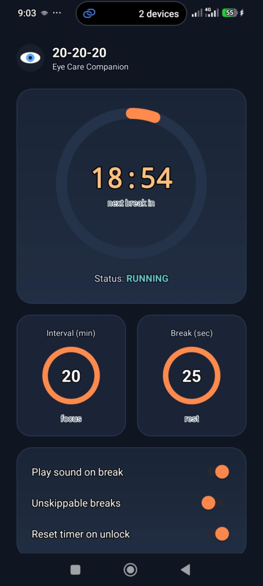
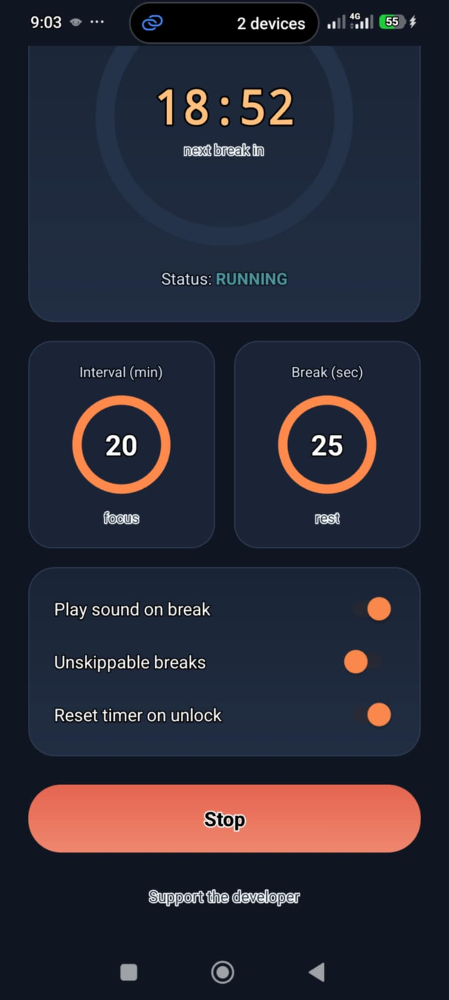
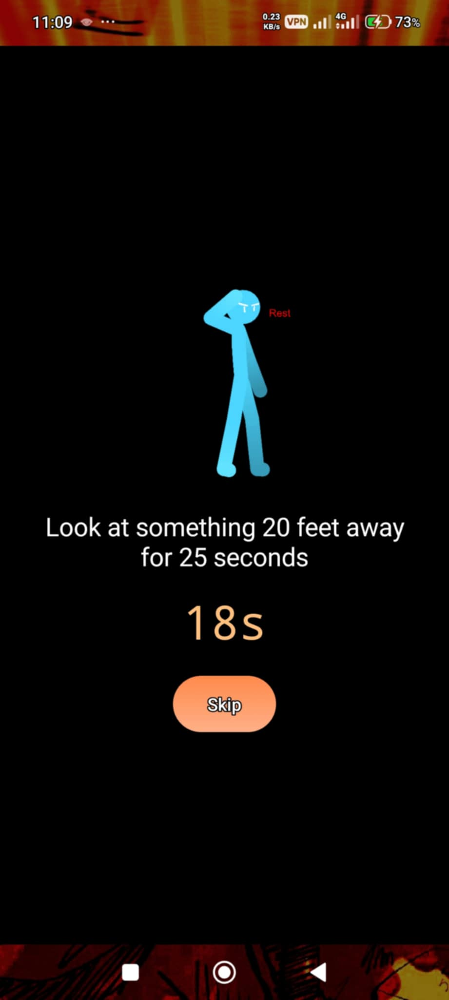

# 20-20-20

An Android app for the 20-20-20 eye rule: every 20 minutes, look at something
20 feet away for 20 seconds. The app shows a fullscreen overlay on top of
whatever you're doing when it's time for a break.

Interval and break length are both adjustable. No account, no ads, no
network access beyond the optional support link.

## Demo

[
](https://github.com/user-attachments/assets/c547d86b-3090-4e06-bf6c-718806a4b85f)
## Screenshots
<span>





</span>


## Features

- Fullscreen break overlay, works on top of any app
- Adjustable interval and break length
- Persistent notification with a live countdown
- Optional sound on break
- Optional "unskippable" mode (no Skip button, ignores back button)
- Optional timer reset when you unlock your phone
- Survives reboots if it was running

## Building

Requires JDK 17, the Android SDK (platform 34, build-tools 34.0.0), and
Gradle. No Android Studio needed.

```
gradle assembleDebug
```

The APK ends up at `app/build/outputs/apk/debug/app-debug.apk`.

## Permissions

- `SYSTEM_ALERT_WINDOW` - draws the break screen over other apps
- `SCHEDULE_EXACT_ALARM` - keeps the interval accurate
- `POST_NOTIFICATIONS` - shows the countdown notification
- `RECEIVE_BOOT_COMPLETED` - resumes the schedule after a restart

## License

MIT, see `LICENSE`.
